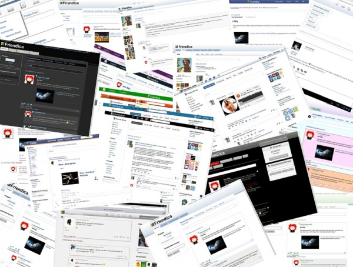

# Friendica-Themes

* Friendica-Themes.com (404) was an unofficial Friendica community website.
* This repo archives content from the now defunct wiki
* Most of it was written around 2012, so the listed themes are only usable as an inspiration if you would like to recreate them on a current Friendica version.

From the Friendica developers:

* [official.md](official.md)
* [frio-color-scheme.md](frio-color-scheme.md)

If you're brave, check, check the unofficial themes from Friendica users all over the world:

* [unsupported.md](unsupported.md)
* [user-themes.md](user-themes.md)
* [lab.md](lab.md)

Contact:

* [contact.md](contact.md)

## Source

* https://web.archive.org/web/20190709222550/https://friendica-themes.com/doku.php?id=start

