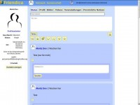

# New UserThemes

(still under heavy development)

If you've begun to create a theme, but it's not quite ready for “a production environment”, yet you'd welcome collaboration, want to share your vision so that someone else can use it as a springboard for their own, or just want to let folks have a preview of your theme before you release it, this is the place!

## Saar

* Written from scratch to build a compact, functional and beautiful theme. It includes rewritten JavaScript code without jQuery dependencies, CSS with responsive design and several color schemes.
* heavily inspired from the "Vier" theme
* Some of the icons are taken from the Tango icon theme.
* Still alpha!
* Download Saar
* https://gitlab.com/bkil/ncc-1988-friendica-themes/-/tree/master/Saar
* author: [Moritz Strohm](https://www.kanoa.de/@mstrohm)
