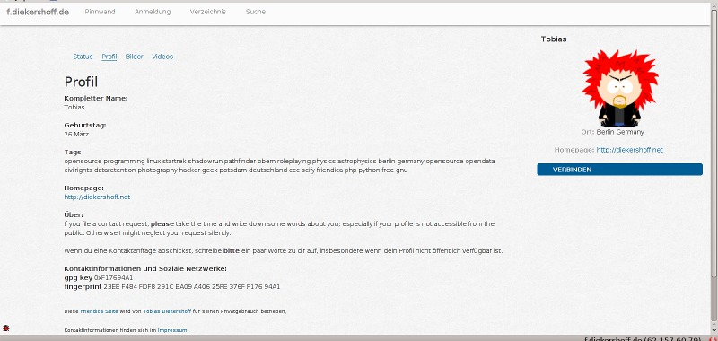
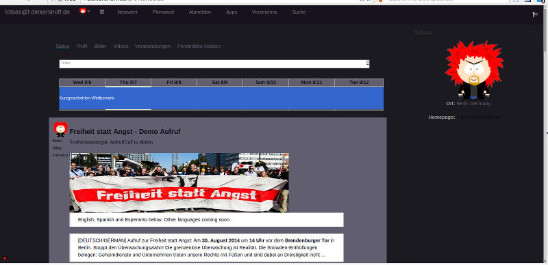
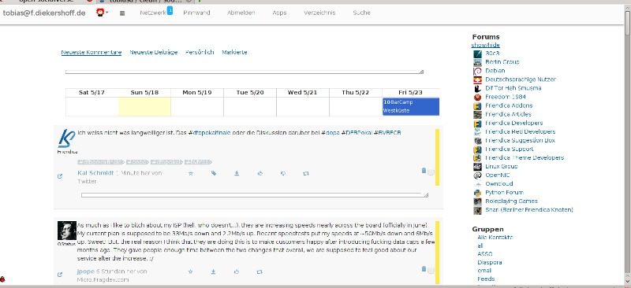
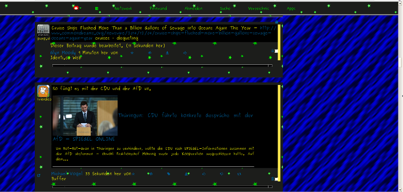
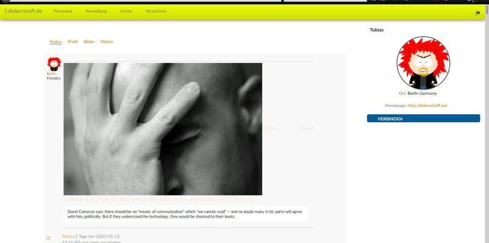
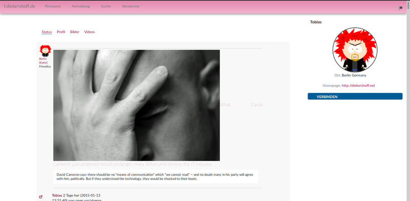
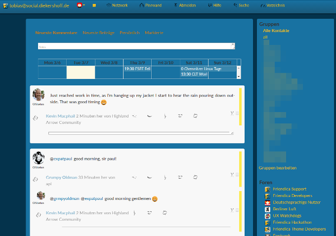
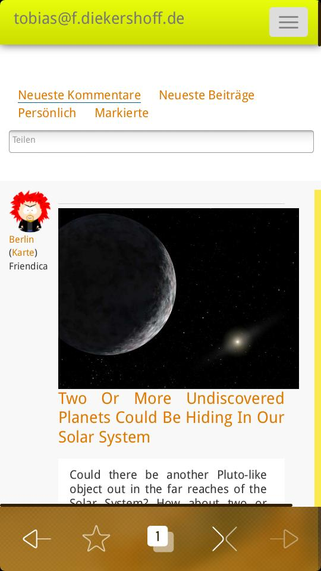

Clean Theme
===========

A theme by [Tobias Diekershoff][td] for [Friendica][f] employing Twitters [bootstrap framework][bs] (see /bs directory). 
The theme aims to offer a clean responsive interface for friendica. 
For accessability the theme supports the default access keys as mentioned in the friendica documentation.
It based on the quattro theme by [Fabio Comuni][fc] which is shipped with friendica.

***This theme needs at least Friendica 3.4.1 to function properly.***

The foundation for the "GeoCities" color preset is done by Divshot with the
[Geo for Bootstrap][geo] theme.

Screenshorts
------------
These screenshorts are taken on my desktop machine, running KDE at a resolution
of1600x900 pixel. Scaled down to a width of 800px.

Screenshot on a mobile device (The Jolla phone in landscape mode), also scaled
to a width of 800 pixel.

Possible Customizations
-----------------------

The site administrator can set custom values for

* background / cover image
* background color and
* font size.

Users can customize their view by changing the above values in the _view
settings_.

One can define styling presets (ATM there is the default, dark, zenburn, black,
pink, lime and a retro one) similar to the quattro and vier themes to make
branding of the pages easy.

Since friendica 3.4.1 the user settings are used for non logged in visitors
of the profile pages as well.

Should you want to use this theme for mobile only, you can simple add a file
called ''mobile'' to the base directory of the theme. This will mark the theme
as *mobile* theme for friendica and you can then select it in the drop down
for mobile themes.

Known Problems
--------------

* if the site admin has set a background image and you don't want to see one in
  your view, enter a single space into the "Background Image" field in your
  view settings.

ToDo-list
---------

* the main dropdown seems not to work correctly on WebOS
* hunt down badly styled things (remember this is an early version of the theme)

License
-------

The clean theme is licensed under the [MIT][MIT] license.

Copyright (c) 2013 - 2017 Tobias Diekershoff

Permission is hereby granted, free of charge, to any person obtaining a copy
of this software and associated documentation files (the "Software"), to deal
in the Software without restriction, including without limitation the rights
to use, copy, modify, merge, publish, distribute, sublicense, and/or sell
copies of the Software, and to permit persons to whom the Software is
furnished to do so, subject to the following conditions:

The above copyright notice and this permission notice shall be included in
all copies or substantial portions of the Software.

THE SOFTWARE IS PROVIDED "AS IS", WITHOUT WARRANTY OF ANY KIND, EXPRESS OR
IMPLIED, INCLUDING BUT NOT LIMITED TO THE WARRANTIES OF MERCHANTABILITY,
FITNESS FOR A PARTICULAR PURPOSE AND NONINFRINGEMENT. IN NO EVENT SHALL THE
AUTHORS OR COPYRIGHT HOLDERS BE LIABLE FOR ANY CLAIM, DAMAGES OR OTHER
LIABILITY, WHETHER IN AN ACTION OF CONTRACT, TORT OR OTHERWISE, ARISING FROM,
OUT OF OR IN CONNECTION WITH THE SOFTWARE OR THE USE OR OTHER DEALINGS IN
THE SOFTWARE.

[td]: https://f.diekershoff.de/profile/tobias
[f]: http://friendica.com
[bs]: http://getbootstrap.com
[fc]: https://kirgroup.com/profile/fabrixxm
[MIT]: http://opensource.org/licenses/MIT
[geo]: http://code.divshot.com/geo-bootstrap/
