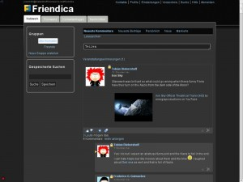
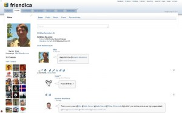
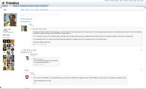
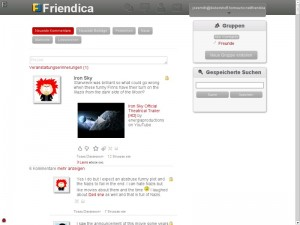
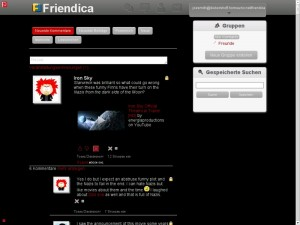
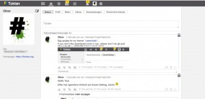

# gallery-unsupported

Unsupported official themes are bundled with your friendica installation package, but marked with an empty file (named “unsupported”).
 
If anyone wants to use unsupported themes, just add this line to your `.htconfig.php` and the themes becomes visible in the admin panel:

```
$a->config['system']['show_unsupported_themes'] = true;
```

… but, we have good reasons for marking these themes “unsupported” ;-)

## Official but unsupported themes

### Cleanzero


### Darkzero



### Comix-Plain



### Comix



### Testbubble



### Darkbubble



### Diabook


### Smoothly


## Unofficial and unsupported themes

Not longer supported user-themes … maybe usable, maybe not.

### Viereinhalb



* Based on the official theme Vier
* smaller font-size, no shadows, less rounded corners, static sidebar
* Smarty3 ready
* Download from Github
* https://web.archive.org/web/20190709222419/https://github.com/23n/Viereinhalb (404)

### Neptune

* Version 2.0
* Based on Frost-Mobile, static Nav-bar, no shadows, smaller font-size.
* Supports Smarty3
* Download Neptune Theme
* https://web.archive.org/web/20190709222419/https://github.com/23n/Neptune (404)
* https://web.archive.org/web/20200919033349/https://github.com/23n/friendica-themes/tree/master/neptune (404)

### Steelblog


* simple, clean design, with brushed steel background, steel tube nav elements
* get it on github here:
* https://github.com/bkil/fthemes/blob/master/steelblog

### Paper


* simple, clean, with parchment/paper background
* get it on github here:
* https://github.com/bkil/fthemes/blob/master/paper

### Terminal


* supports Smarty3
* your basic black/tty theme
* on github here:
* https://github.com/bkil/fthemes/blob/master/terminal

### Final Frontier


* supports Smarty3 and the Prime Directive
* Star Trek theme
* on github here:
* https://github.com/bkil/fthemes/blob/master/finalfrontier

### Whovian


* Dr. Who/Tardis theme
* If you don't speak Gallifreyan, you wouldn't understand
* Derived from Transzero
* on github:
* https://github.com/bkil/fthemes/blob/master/whovian

### PrinTimes


* supports Smarty3
* Clean, News Print, bloggy theme
* on github here:
* https://github.com/bkil/fthemes/blob/master/printimes

### Free-Haven


* Theme from [https://web.archive.org/web/20111025220325/http://free-haven.org/status/](https://free-haven.org)
* Partly cloudy with a chance of FREEDOM!
* supports Smarty3
* on github here:
* https://github.com/bkil/fthemes/blob/master/freehaven

### DeathStar


* supports Smarty3
* Will RULE THE GALAXY!
* Star Wars theme (duh)
* on github here:
* https://github.com/bkil/fthemes/blob/master/deathstar

### Bubbly


* serene, aquatic, blue, bubbly theme, clean design, rounded corners, bubbly background
* get it on github here:
* https://github.com/bkil/fthemes/blob/master/bubbly

### Hippy


* hey man, did a rainbow unicorn like puke on your profile or something?
* naw, man, but this is some good stuff! w0w…
* get it on github here:
* https://github.com/bkil/fthemes/blob/master/hippy

### Tazman


* a bacony good theme by Tazman.
* extends `duepuntozero`
* https://github.com/bkil/fthemes/blob/master/tazman
