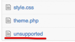
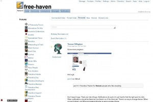
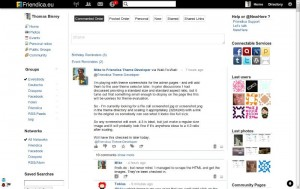

# gallery-unsupported

Unsupported official themes are bundled with your friendica installation package, but marked with an empty file (named “unsupported”).


 
If anyone wants to use unsupported themes, just add this line to your `.htconfig.php` and the themes becomes visible in the admin panel:

```
$a->config['system']['show_unsupported_themes'] = true;
```

… but, we have good reasons for marking these themes “unsupported” ;-)

See below for older screenshots of official themes.

## duepuntozero

colorsets: default, greenzero, purplezero, easterbunny, darkzero, comix, slackr

### greenzero


https://github.com/friendica/friendica/tree/e32a39d1294e2ae2954dcc977128f5942ec65fd8/view/theme/greenzero

> green variation by Tobias Diekershoff <tobias.diekershoff@gmx.net>

### purplezero


https://github.com/friendica/friendica/tree/e32a39d1294e2ae2954dcc977128f5942ec65fd8/view/theme/purplezero

### easterbunny


https://github.com/friendica/friendica/tree/e41005ce6ea9d6c41e950f0f8be808e1b31898ee/view/theme/easterbunny

### darkzero


> Author: Fabio Comuni <https://social.gl-como.it/profile/fabrixxm>

https://github.com/friendica/friendica/tree/e32a39d1294e2ae2954dcc977128f5942ec65fd8/view/theme/darkzero

### darkzero-NS

> Darkzero theme with posts that do not scroll
> Author: Mike Macgirvin <mike@macgirvin.com>

https://github.com/friendica/friendica/tree/e32a39d1294e2ae2954dcc977128f5942ec65fd8/view/theme/darkzero-NS

### Comix


> An irreverent theme
> Author: Mike Macgirvin <mike@macgirvin.com>

https://github.com/friendica/friendica/tree/e32a39d1294e2ae2954dcc977128f5942ec65fd8/view/theme/comix

### Comix-plain


> Comix theme with a standard font
> Author: Mike Macgirvin <mike@macgirvin.com>

https://github.com/friendica/friendica/tree/e32a39d1294e2ae2954dcc977128f5942ec65fd8/view/theme/comix-plain

### slackr


https://github.com/friendica/friendica/tree/e32a39d1294e2ae2954dcc977128f5942ec65fd8/view/theme/slackr

### slack-NS

https://github.com/friendica/friendica/tree/e32a39d1294e2ae2954dcc977128f5942ec65fd8/view/theme/slack-NS

## quattro

### quattro-green


Right before merging into Quattro

https://github.com/friendica/friendica/tree/01af7d355a0dfdf19db7acf3b5b06b683c58531e/view/theme/quattro-green

## Deprecated official themes

These were part of the official git repo in the past but have been removed since then.

For an overview that lacks git history, see:

* https://github.com/friendica/deprecated-themes

### loozah


This was the default theme in 2010

> Loozah CSS - Emmanuel Revah https://manurevah.com/blah/en/contact
> Copy, Paste, Send - Free
>	this is still considered as messy

https://github.com/friendica/friendica/tree/109e8d4f05bedf8afcd3404d25a0fcc04c0c9086/view/theme/loozah

### goldenrod


> extends loozah

https://github.com/friendica/friendica/tree/109e8d4f05bedf8afcd3404d25a0fcc04c0c9086/view/theme/goldenrod

### shady


> extends loozah

https://github.com/friendica/friendica/tree/109e8d4f05bedf8afcd3404d25a0fcc04c0c9086/view/theme/shady

### three-d


> extends loozah

https://github.com/friendica/friendica/tree/109e8d4f05bedf8afcd3404d25a0fcc04c0c9086/view/theme/three-d

### darkness


> extends loozah

https://github.com/friendica/friendica/tree/109e8d4f05bedf8afcd3404d25a0fcc04c0c9086/view/theme/darkness

### clean


> extends loozah

https://github.com/friendica/friendica/tree/109e8d4f05bedf8afcd3404d25a0fcc04c0c9086/view/theme/clean

### Cleanzero




> Theme with clean design derived from the zero theme family. Including options to set color schemes, font sizes and resizing of images in posts 
> Author: Christian Vogeley <https://christian-vogeley.de/kontakt/>

https://github.com/friendica/friendica/tree/e32a39d1294e2ae2954dcc977128f5942ec65fd8/view/theme/cleanzero

### darkbubble


> Dark Bubble
> Maintainer: Mike Macgirvin <mike@macgirvin.com>

https://github.com/friendica/friendica/tree/e32a39d1294e2ae2954dcc977128f5942ec65fd8/view/theme/darkbubble

### decaf-mobile


> Decaf--mobile version
> No Javascript theme
> Credits: Navigation icons taken from http://iconza.com. Other icons taken from http://thenounproject.com, including: Like, Dislike, Black Lock, Unlock, Pencil, Tag, Camera, Paperclip (Marie Coons), Folder (Sergio Calcara), Chain-link (Andrew Fortnum), Speaker (Harold Kim), Quotes (Henry Ryder), Video Camera (Anas Ramadan), and Left Arrow, Right Arrow, and Delete X (all three P.J. Onori). All under Attribution (CC BY 3.0). Others from The Noun Project are public domain or No Rights Reserved (CC0).
> Author: Zach P <techcity@f.shmuz.in>

https://github.com/friendica/friendica/tree/e32a39d1294e2ae2954dcc977128f5942ec65fd8/view/theme/decaf-mobile

### diabook




> report bugs and request here: http://pad.toktan.org/p/diabook
> Fabio Comuni <https://social.gl-como.it/profile/fabrixxm>
> Additional Changes: Michael Vogel <https://pirati.ca/profile/heluecht>

* https://github.com/friendica/friendica/tree/e32a39d1294e2ae2954dcc977128f5942ec65fd8/view/theme/diabook
* https://github.com/friendica/friendica/tree/d072c12e7dcc5871c52a0ef552a60cb40a9b7fa2/view/theme/diabook

### dispy


> Dispy family (light, dark): Sleek and Functional Themes 
> It went through a minor re-vamp, keeping to its spartan look as much as possible.
> I added more rounded corners, and as Friendica grew in capabilities and features, so did it - but, I always wanted to keep the features down, so as to be fast and spartan, which seems to appeal to a lot of the geekier users.
> Author: Mike Macgirvin, Emmanual Revah, Simon <http://simon.kisikew.org/>

https://github.com/friendica/friendica/tree/e32a39d1294e2ae2954dcc977128f5942ec65fd8/view/theme/dispy

### The Red Matrix - APW


> A Polymorphic Wapentake theme for the Red Matrix.

https://github.com/friendica/red-themes/tree/master/apw

### facepark


> Author: Fabio Comuni <https://social.gl-como.it/profile/fabrixxm>
> Vijay's theme from facepark.in

* https://github.com/friendica/friendica/tree/e32a39d1294e2ae2954dcc977128f5942ec65fd8/view/theme/facepark
* https://web.archive.org/web/20111018070807/http://facepark.in:80/index.php?p=browse
* https://web.archive.org/web/20111018151535/http://facepark.in:80/index.php?p=games/games1
* https://web.archive.org/web/20111018151646/http://facepark.in:80/index.php?p=u/eddy
* https://web.archive.org/web/20120308085530/http://facepark.in/

### testbubble


https://github.com/friendica/friendica/tree/e32a39d1294e2ae2954dcc977128f5942ec65fd8/view/theme/testbubble

> Test Bubble
> Author: Anne Walk, Devlon Duthied
> Based loosely on the Dipsy theme

### Frost


https://github.com/friendica/friendica/tree/00311af79b76fe8caf57877fc7abdb00925c6044/view/theme/frost

### Frost-mobile


https://github.com/friendica/friendica/tree/00311af79b76fe8caf57877fc7abdb00925c6044/view/theme/frost-mobile
