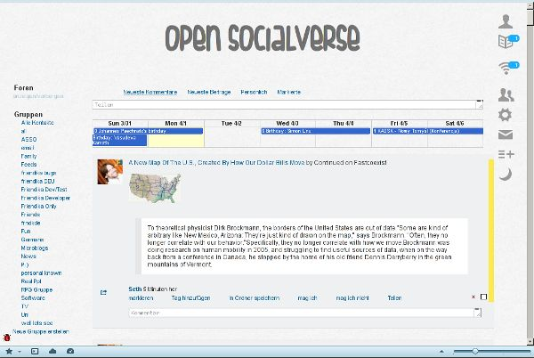
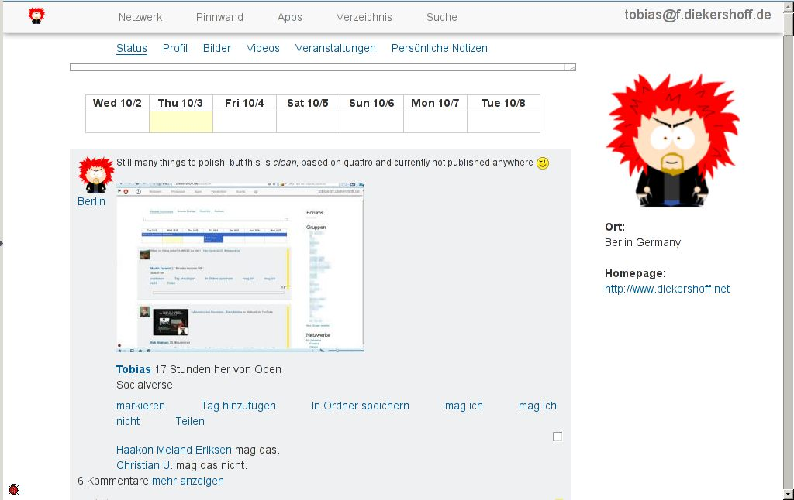
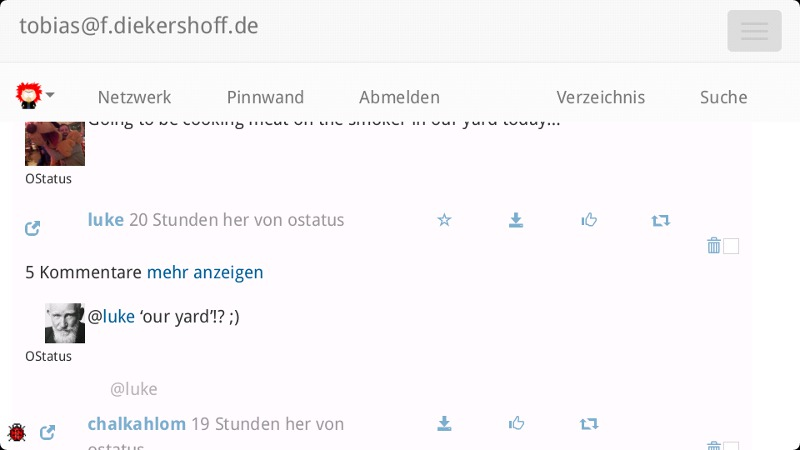
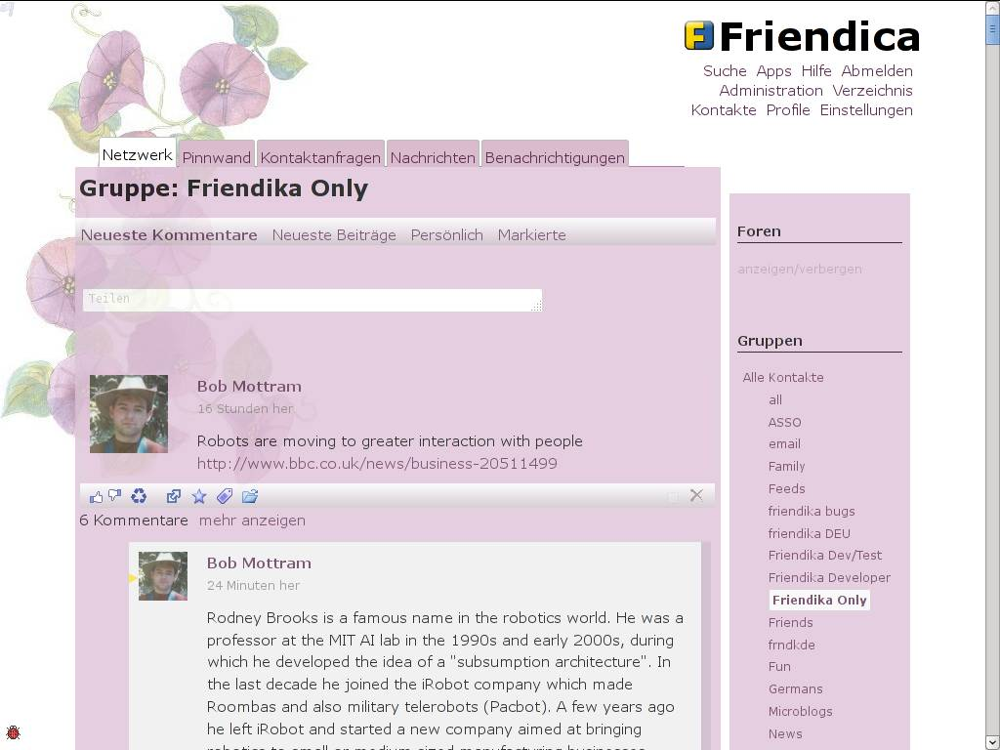

# User Themes

## Fishfinger Theme

Download latest code

* [tobiasd-friendica-fishfinger](tobiasd-friendica-fishfinger)
* https://bitbucket.org/tobiasd/friendica-fishfinger/get/tip.zip (404)
* https://bitbucket.org/tobiasd/friendica-fishfinger/src/5b0e55c340f5?at=default (404)
* https://bitbucket.org/tobiasd/friendica-fishfinger/raw/5b0e55c340f5497c91e81744250cfcc5d4b34078/screenshot.jpg (404)

* based on quattro
* works only with smarty3 templating engine so you need at least ~friendica 3.1

Releases

* https://web.archive.org/web/20200622000117/https://bitbucket.org/tobiasd/friendica-fishfinger/downloads/?tab=tags

## Clean Theme

Desktop:

Mobile:

* https://friendica-themes.com/lib/exe/fetch.php?w=300&tok=ba7d66&media=https%3A%2F%2Fbitbucket.org%2Ftobiasd%2Fclean%2Fraw%2F599ccc6ab749973d59e90fc75b37d29c75e39e38%2Fimg%2Fclean_profile.jpg (404)

Download latest code: (404)

* [tobiasd-clean](tobiasd-clean)
* https://bitbucket.org/tobiasd/clean/get/tip.zip (404)

* based on quattro employing Twitters bootstrap for responsive design, so you don't need a mobile theme
* offers 6 preset color sets
* offers the ability to cusomize fontsize, background color and the background image; so users can easily customize their friendica
* works with ~friendica 3.4.1 and later

Releases

* https://web.archive.org/web/20200623041730/https://bitbucket.org/tobiasd/clean/downloads/?tab=tags

## Blog Theme

* https://github.com/bkil/friendicablog

Theme for a _blog like_ interface of the profile, see for example:

* https://web.archive.org/web/20111104150346/http://kirgroup.com/community

## Translucent Fluidity

Download Translucent Fluidity Theme

* [tobiasd-friendica-translucent-fluidity](tobiasd-friendica-translucent-fluidity)
* https://bitbucket.org/tobiasd/friendica-translucent-fluidity/src/a09887208ccf?at=default (404)

Releases

* https://web.archive.org/web/20200621233427/https://bitbucket.org/tobiasd/friendica-translucent-fluidity/downloads/?tab=tags

### KakSte

* a Dispy derivative
* https://web.archive.org/web/20200919033349/https://github.com/beardy-unixer/kakste-theme (404)
* https://web.archive.org/web/20131021032649/http://kakste.com/community

### Cleardia

* based on Diabook
* https://web.archive.org/web/20200919033349/https://github.com/beardy-unixer/cleardia (404)

## Source

* https://web.archive.org/web/20190709222136/https://friendica-themes.com/doku.php?id=usergallery
